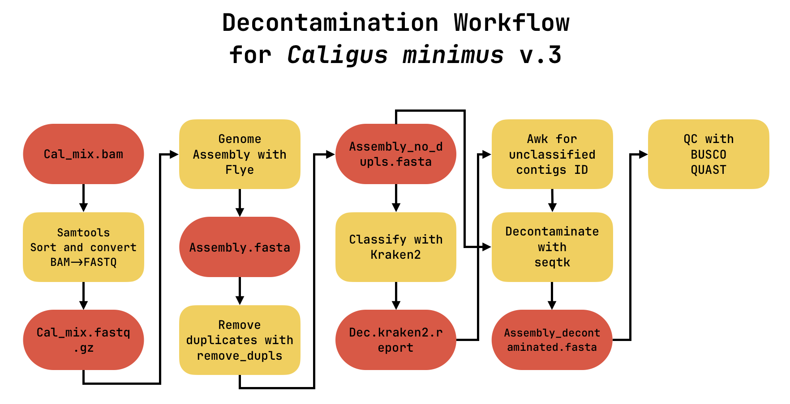

# Workflow for Decontamination of Genome Assembly of _Caligus minimus_

## Introduction

This workflow is intended for genome decontamination of _Caligus minimus_, a species of the _Caligidae_, a well-known copepod ectoparasite, from PacBio HiFi reads.

## The Workflow



### Flye (Kolmogorov, 2020)
Flye is a de novo assembler for single-molecule sequencing reads, such as those produced by PacBio and Oxford Nanopore Technologies.
The flye assembler outputs polished contigs.

_For more information, you can visit the repository [here](https://github.com/mikolmogorov/Flye)._

### Kraken 2 (Wood, 2019)
Kraken 2 is a taxonomic sequence classifier that assigns taxonomic labels to DNA sequences. Kraken examines the k-mers within a query sequence and uses that information to query a database. The database maps k-mers to the lowest common ancestor (LCA) of all genomes known to contain a given k-mer.

_For more information, you can visit the repository [here](https://github.com/DerrickWood/kraken2)._

### Seqtk
Seqtk is a toolkit for processing sequences in FASTA/FASTQ files. In this workflow, it is used to generate the decontaminated assembly from the data derived from the Kraken2 classification report.

_For more information, you can visit the repository [here](https://github.com/lh3/seqtk)._

### BioGenie
BioGenie is a complete bioinformatics tool, used in this workflow to compare the number of contigs between the contaminated and decontaminated assemblies.

_For more information, you can visit the repository [here](https://github.com/mikeph52/BioGenie)._

## Installation
### Resolve Dependencies
The scripts are written to support Conda and SLURM in order to run on HPC systems.

To run this workflow, the use of a conda environment is recommended. To create the environment with all the dependencies:

1. Clone the repository:
```bash
git clone https://github.com/mikeph52/decontam_lice
```

2. Create the conda environment:
```bash
conda env create -f environment.yaml
```

3. If you're using SLURM, run the workflow:
```bash
sbatch workflow.sh
```

## Acknowledgements

All data used for the development of this workflow were provided by the
**Institute of Marine Biology, Biotechnology and Aquaculture (IMBBC)**
of the **Hellenic Centre for Marine Research (HCMR)**, Heraklion, Crete.
This workflow was developed and executed on the **Zorbas HPC** infrastructure of IMBBC-HCMR.